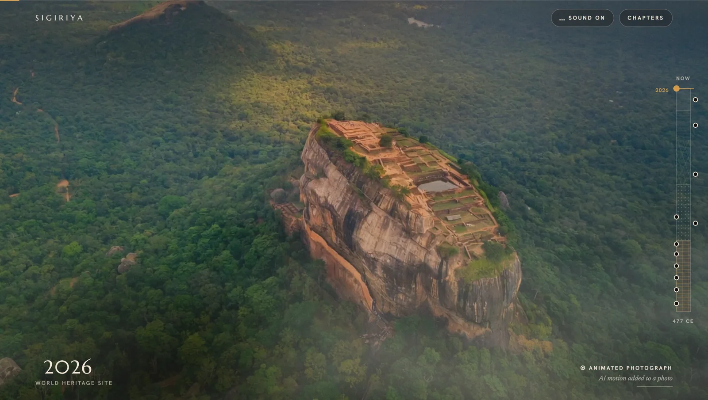

# Sigiriya — Journey Through Time

A scroll-driven documentary about the rock fortress of Sigiriya, Sri Lanka. Scroll position *is* the age of the site: the first half travels 2026 → 477 CE, the second returns to the present.

**[▶ Live demo — sinha-giri.vercel.app](https://sinha-giri.vercel.app/)**



## What it is

Sixteen chapters carry the reader from the rock as it stands today back to the reign of Kashyapa I and forward again — the gardens, the ascent, the Lion Gate, the frescoes, the summit palace, the centuries of ruin, the rediscovery. Every present-day photograph is paired with a reconstruction of the same framing, and the scroll dissolves between them.

Because a good deal of the imagery is AI-generated, the interface says so continuously: an evidence chip names what you are looking at — photograph, animated photograph, reconstruction or illustration — and a bar shows how much of the current frame is interpretation rather than record.

## How it works

- **One clock.** `src/lib/time/curve.ts` defines the year curve and what the year implies physically (`standing`, `overgrowth`, strata).
- **One choreography table.** `src/lib/journey/choreography.ts` maps each chapter's local progress + year to the world state (plate, reveal mask, camera, fog, warmth, vegetation, drawing, silhouette).
- **One scroll reader.** `src/lib/journey/controller.ts` runs on `gsap.ticker`: measures chapters with ScrollTrigger, smooths scroll, derives the year, writes `timeState`, and scrubs every chapter's paused GSAP timeline.
- **One world pass.** `src/components/world/` is a single Three.js full-screen shader (dynamically imported) that blends each present-day photo with its reconstruction. `FallbackWorld` covers first paint and no-WebGL devices.
- **Films.** Nine Higgsfield (Kling 3.0) clips, each generated from one of the photographs and upscaled to 1080p with Topaz, are listed in `src/lib/journey/films.ts`. The choreography names a clip per chapter and where the scroll puts its playhead, so scrolling moves the camera and time together. The world canvas downloads clips in journey order and binds each one to the shader in place of its plate, so fog, grain and warmth still apply. Until a clip is ready, its plate stands in (the plate is the clip's first frame). Reduced motion and Save-Data skip video. Clips are encoded at 1080p, 720p and 480p with a keyframe every 4 frames so that seeking stays quick in both directions; the page picks a size from the screen width and pixel density.
- **Chapters** (`src/components/chapters/`) are sticky stages whose DOM timelines are normalised to duration 1. Most run inside the shader world; a few, like the frescoes gallery, are their own lit scene.
- **HUD**: the stratigraphic column (depth = age), the year readout, and the evidence chip (photograph / reconstruction / illustration).
- **Sound** is synthesised with Web Audio — no audio files, nothing to download. It is on by default; because browsers keep audio silent until the visitor interacts, and a wheel scroll does not count, the mix starts at the first click, tap or key.

Content and sources live in `src/content/`. Plate alignment calibration is in `src/lib/journey/plates.ts` — one calibration per image drives both the shader and the Then/Now comparison slider.

## Tech

Next.js 16 (App Router) · React 19 · TypeScript · Three.js via @react-three/fiber · GSAP with ScrollTrigger · Tailwind CSS v4 alongside hand-written CSS · Web Audio · sharp and ffmpeg-static for the asset pipeline.

## Getting started

```bash
npm install
npm run dev          # http://localhost:3000
npm run build && npm start
npm run lint
```

## Asset pipeline

Source material lives in `assets-src/` and is never served directly:

```bash
npm run images       # assets-src/{modern,ancient}/* → /public/plates/*.webp (1280 and 2400 wide)
npm run films        # assets-src/films/*.mp4 → /public/films/*-{480,720,1080}.mp4
```

`prepare-films.mjs` cropdetects and strips the letterboxing the upscaler adds before re-encoding.

## Accessibility and performance

Reduced motion replaces pans and parallax with cuts and holds, and stops video loading entirely; Save-Data does the same. There is a skip link to the sources and historical notes, alt text on every plate describing both what is shown and whether it is a reconstruction, and the chapter menu is a real `<dialog>`. The shader and the film decoder are dynamically imported so first paint does not wait for them.

## Deployment

Deployed on Vercel at [sinha-giri.vercel.app](https://sinha-giri.vercel.app/). Set `NEXT_PUBLIC_SITE_URL` in the project's environment so Open Graph URLs resolve absolutely.

## Before public release

- Set `NEXT_PUBLIC_SITE_URL` for correct Open Graph URLs.
